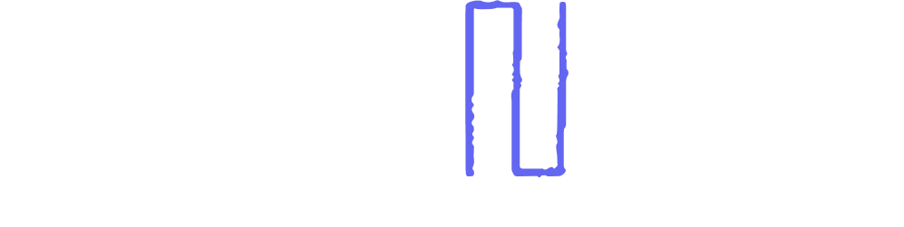

# DepeNsee: Advanced JavaScript Dependency Visualization



**DepeNsee** is a powerful tool for visualizing dependencies in JavaScript/TypeScript projects, offering both project-level dependency graphs and detailed file exploration with method-level analysis.

## Table of Contents

- [Features](#features)
- [Installation](#installation)
- [Usage](#usage)
- [Multi-Panel File Exploration](#multi-panel-file-exploration)
- [Method Dependency Analysis](#method-dependency-analysis)
- [Visualization Controls](#visualization-controls)
- [Project Structure](#project-structure)
- [Technical Architecture](#technical-architecture)
- [Performance Considerations](#performance-considerations)
- [Troubleshooting](#troubleshooting)
- [Future Enhancements](#future-enhancements)
- [License](#license)

## Features

### Project-Level Visualization

- **Interactive 3D/2D Dependency Graph:** Visualize your entire project structure with nodes representing files and connections showing import relationships
- **File Type Coloring:** Different file types (.js, .ts, .jsx, .tsx) are color-coded for easy identification
- **Library Dependency Detection:** External library imports are automatically detected and visualized
- **Advanced Filtering:** Filter by filename, file type, and library with dependency chain awareness
- **Search Functionality:** Quickly find specific files in large codebases

### File-Level Exploration

- **Multi-Panel File View:** Click any file to open a detailed exploration with three panels:
  - **Dependencies Panel:** Shows files and libraries imported by the current file
  - **Methods Panel:** Visualizes methods/functions with call dependencies
  - **Dependents Panel:** Shows files that import the current file
- **Resizable Panels:** Drag dividers to adjust panel sizes based on your focus
- **Panel-Specific 2D/3D Toggle:** Each panel can be independently viewed in 2D or 3D
- **File-to-File Navigation:** Click on dependencies or dependents to navigate between files

### Method-Level Analysis

- **Method Parsing:** Automatically extracts methods, functions, and their relationships
- **Method Call Graph:** Visualizes which methods call which within a file
- **Method Details:** View parameter information, return types, and call dependencies
- **Method Types:** Different visualizations for regular functions, class methods, and arrow functions

## Installation

### Prerequisites

- [Node.js](https://nodejs.org/) (version ≥ 14.0.0 recommended)
- npm (comes with Node.js) or yarn

### Steps

1. **Clone the repository:**

   ```bash
   git clone https://github.com/yourusername/depensee.git
   cd depensee
   ```

2. **Install dependencies:**

   Using npm:

   ```bash
   npm install
   ```

   Or using yarn:

   ```bash
   yarn install
   ```

3. **Run the application:**

   For production:

   ```bash
   npm start
   ```

   For development (with nodemon):

   ```bash
   npm run dev
   ```

4. **Access in browser:**  
   Navigate to [http://localhost:5000](http://localhost:5000) in your web browser.

## Usage

### Analyzing a Project

1. Open DepeNsee in your browser
2. Enter the absolute path to your project directory
3. Choose whether to enable method parsing (can be disabled for very large projects)
4. Click "Analyze Project"
5. Explore the interactive dependency graph

### Using Demo Mode

If you want to test DepeNsee without a project:

1. Click "Try with Demo Data" on the welcome screen
2. A mock project with realistic dependencies will be generated for exploration

## Multi-Panel File Exploration

The multi-panel view is accessed by clicking on any file node in the main visualization.

### Panel Navigation

- **Left Panel (Dependencies):** Shows files and libraries imported by the current file
  - The current file appears as a central node
  - Dependencies are arranged in a radial layout around it
  - Click any dependency to navigate to it

- **Center Panel (Methods):** Visualizes methods and functions within the file
  - Methods are shown as nodes with connections representing calls
  - Color coding differentiates between regular functions, class methods, and arrow functions
  - Hover over methods to see details and highlight relationships

- **Right Panel (Dependents):** Shows files that import the current file
  - Each dependent file is represented as a node
  - Click any dependent to navigate to it

### Panel Controls

- **Resize Panels:** Drag the dividers between panels to resize
- **2D/3D Toggle:** Each panel has its own toggle between 2D and 3D visualization
- **Back to Graph:** Return to the main project visualization

## Method Dependency Analysis

Method parsing extracts function and method information from your code:

### Method Detection

- Regular functions (`function name() {}`)
- Class methods (inside `class` declarations)
- Arrow functions (`const name = () => {}`)
- Function expressions (`const name = function() {}`)

### Extracted Information

- Function names and types
- Parameters and return types (when using TypeScript)
- Line numbers and positions
- Method calls between functions

### Method Visualization

Methods are visualized as an interactive graph:

- **Node Colors:** Different colors for functions, methods, and arrow functions
- **Connections:** Arrows show which methods call which
- **Tooltips:** Hover over nodes to see method details

## Visualization Controls

### Main Visualization

- **Toggle 2D/3D:** Switch between 2D and 3D visualization modes
- **Rotate:** Left-click + drag (3D mode only)
- **Pan:** Right-click + drag
- **Zoom:** Scroll wheel
- **Reset View:** Click the reset button to restore default view
- **Search:** Use the search box to find specific files

### Filtering

- **Filename Filter:** Filter by partial filename match
- **File Type Filter:** Show only specific file types (.js, .ts, .tsx, etc.)
- **Library Filter:** Focus on specific library dependencies
- **Dependency Analysis:** Show selected nodes along with:
  - Their dependencies
  - Their dependents
  - Complete dependency chain

### Panel-Specific Controls

- **Node Hover:** Hover over nodes to highlight connections and show details
- **Node Click:** Click nodes to navigate to that file or select that method
- **Panel 2D/3D Toggle:** Each panel can be independently toggled between 2D and 3D

## Project Structure

```
DepeNsee/
├── file-dependency-analyzer.js  # Core dependency analysis engine
├── server.js                   # Express server for API endpoints
├── public/                     # Front-end files
│   ├── css/
│   │   └── styles.css          # UI styling
│   ├── js/
│   │   ├── main.js             # Application initialization
│   │   ├── DependencyVisualizer.js  # Main visualization engine
│   │   ├── MethodInfoDisplay.js     # Method info UI component
│   │   ├── dataHandlers.js     # Data processing utilities
│   │   └── utils.js            # Helper functions
│   ├── img/                    # Images and icons
│   └── index.html              # Main HTML template
└── README.md                   # This file
```

## Technical Architecture

### Backend

- **Express Server:** Provides API endpoints for project analysis
- **Babel Parser:** Parses JavaScript/TypeScript files to extract dependencies and method information
- **File System Access:** Recursively scans project directories

### Frontend

- **Three.js:** 3D visualization engine for dependency graphs
- **TrackballControls:** Camera controls for 3D visualization
- **Custom Force-Directed Layouts:** Specialized layouts for different visualization types:
  - Standard force-directed layout for main graph
  - Radial layout for dependencies panel
  - Method-specific layout for function calls

### Data Flow

1. **Project Analysis:**
   - Backend scans project files
   - Files are parsed to extract imports and methods
   - Dependency relationships are mapped

2. **Visualization:**
   - Dependency data is sent to the client
   - Three.js creates interactive graph
   - Force-directed layout positions nodes

3. **File Exploration:**
   - Click on file node triggers multi-panel view
   - Each panel creates its own visualization
   - Method call graph is built from parsed data

## Performance Considerations

### Large Projects

- **Method Parsing Toggle:** Can be disabled for very large projects to improve performance
- **Progressive Loading:** Only the viewed file's methods are analyzed in detail
- **Optimized Rendering:** Visualization optimizations include:
  - Culling of off-screen elements
  - Reduced detail during camera movement
  - Animation frame throttling

### Memory Management

- **Resource Cleanup:** Proper cleanup when transitioning between views
- **Scene Optimization:** Shared materials and geometries to reduce memory usage
- **Texture Management:** Text labels use efficient canvas-based sprites

## Troubleshooting

### Common Issues

- **Long Load Times:** For large projects, consider disabling method parsing
- **Visualization Performance:** Switch to 2D mode for better performance on slower devices
- **Panel Rendering Issues:** If panels appear empty, try resizing the browser window

### Error Recovery

- **Panel Errors:** Each panel has independent error handling
- **Empty States:** Informative messages for panels with no data
- **Back to Graph:** The "Back to Graph" button can be used to reset to the main view

## Future Enhancements

Planned features for future releases:

- **Code Preview:** Show method code on hover
- **File Content Viewer:** View file contents directly in the sidebar
- **Export/Import:** Save visualizations as images or JSON
- **Collaboration Features:** Share visualizations with team members
- **Visual Diff:** Compare dependency structures between project versions
- **IDE Integration:** Plugin versions for VS Code, WebStorm, etc.

## License

This project is licensed under the [MIT License](LICENSE).

---

*Created with DepeNsee - Visualize Your Code Structure*